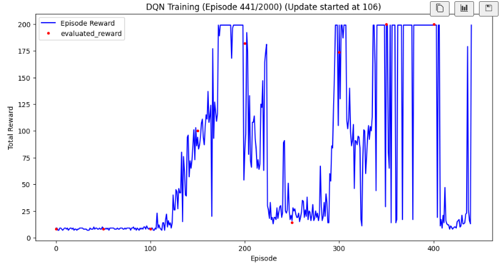

# 总结at20250724：

主要解决了以下的问题：

1. 网络输出爆炸问题：合理设置done时候的reward的值
2. 无法收敛：（其实最后没有实际上解决这个问题，但是可以算是表面上解决了这个问题）
   1. 直接方案：
      1. 早停，防止训练次数过多导致的发散；
      2. 滑动平均：更好的看出趋势，以及确定收敛。选择十次平均，大于175作为收敛条件。
   2. 其他修正：
      1. epsilon取固定值就好了这里选择0.01
      2. memory的capacity要足够大，具体而言就是10000
      3. 使用soft update效果不好，直接做update；但是更新频率要选择好，这里选择的是200（因为cartpolev0的terminated的轮次是200，虽然不知道v0，但是v1选择500比较好，所以可以类比的感觉）
      4. batchsize选择256比较好。

最终效果：只使用100多个step就收敛了。


# 问题1：

```python
target: tensor([1.0178e+10], device='cuda:0')
tensor([[7.6236e+09, 0.0000e+00]], device='cuda:0', grad_fn=<ReluBackward0>)
q: tensor([7.6236e+09], device='cuda:0', grad_fn=<SelectBackward0>)
```

网络输出爆炸式增长。

- 原因：当Q值被高估时，目标值会进一步放大误差，陷入 Q值↑ → 目标值↑ → Q值↑↑ 的恶性循环。
- 方案：修正经验回放池；修改gamma参数（0.8可以，0.9过大，很奇怪，要么不收敛，要么收敛的太早，探索不到比较好的效果）；衰减epsilon，添加了epsilon类，但是无济于事。
- 实际解决方案：修改reward的定义（done的时候选择reward为-5而不是默认的1，没有给terminated设置单独的reward），以及添加双DQN（即是引入target network的方案）。

# 问题2：


- 无法收敛。
- 修改方案：修正epsilon过小的问题，保证epsilon在开始探索时仍然比较大，此处选择0.99所谓epsilon的指数衰减常数；可能前面效果不够好就是因为在随即探索吧。
- 不足：效果仍然不够好；
  
- 测试效果（参见dqn02）：


- 也就是仍然无法收敛，但是可以探索到比较好的参数了，现在。

## 备忘录：

主要是效果太好了：


## 信息：

> 需要注意的是，v1 版本 的最大步数限制为 500，而 v0 版本 的限制为 200 步。因此，在使用 Gym 环境时，需通过 gym.make('CartPole-v1') 显式指定版本以确保符合预期的终止条件。此外，若目标是解决 CartPole 问题，通常要求平均奖励达到 475（v1）或 195（v0），但这些与步数限制无关，属于独立的评估标准。

- 也就是说我们的目标实际上是实现平均奖励达到475以上才可以；
- 决定在环境中添加对应的rollout，并且在图像中显示出来啊。

## 修改2：

为truncated 添加reward = 5.结果消极怠工了？？似乎是的。


- 对比不使用truncated.reward = +5。思考来看的话，truncated和普通的结果是一样的，只是被我们手动终止了而已，所以说这里的reuncated.reward = 1 实际上是比较合理的。但是为什么修改truncated_reward会导致我们的模型探索性下降呢？
- 不理解但是，是事实（dq3实验结果参考）。仍然无法实现收敛。
  

## 信息2：

> 若无终止条件，训练可能持续进行，导致资源浪费或无法收敛。

尝试使用v0测试，减少因为memory太小引起的短视的问题。可能很少才可以得到一个done的结果。

可能比较好的方案是直接设置一个收敛条件，也就是多次rollout的平均值大于某个值就直接终止了，而不是持续训练。因为持续训练可能反而导致发散了。终于收敛了。效果非常好啊。


# 修改尝试3：

尝试修改reward的定义方式，使用参考代码给出的基于姿势进行计算。

> 通过姿态（如杆子角度、角速度）计算奖励，可更精确地反映任务目标。例如，当杆子偏离竖直方向时给予惩罚，或在接近竖直时给予正奖励。（参见dqn05）


- 发现还没有原来的效果好呢。

# 新的信息：

①奖励的问题 ：选择0比较好，而不是简单的-5。
②未使用软更新 ：参数tau选择0.005（可能是固定值）,跟新步数选择500（可能和环境的最大步数有关系）.
③容量太小：选择10000
④gamma选择0.97
⑤batchsiz取256
⑥lr=0.0001

## 仅添加②软更新查看收敛性

效果并不好，甚至失去了探索能力。或者说是收敛的太慢了？尝试过0.5和0.005都不太行的啊。


## 尝试与效果

1. 尝试只修改capacity和batchsize：无效
2. 尝试修改epsilon-greedy算法，也就是使用固定的epsilon，无效
3. 尝试修改奖励机制，有效！接近于收敛曲线，而且稳定性良好！！！
   - 但是仍然是没有收敛：
     
   - 但是如果我指定一个收敛条件呢？似乎也还行吧
     
4. 尝试在3.的基础上，添加软更新保证稳定性。效果比较差
   

# 新注意的问题

使用best测试了v1下的效果，实际展示并不理解，具体来讲就是只是**单纯的在缓慢右移**，并没有实现真正的稳定性。

因此，持续训练和更加复杂的环境是非常必要的唉。以及对环境的设置，使用v0才可能出现这样的问题唉。


