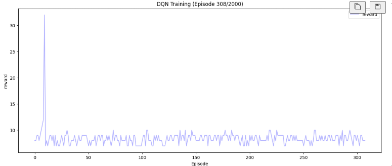
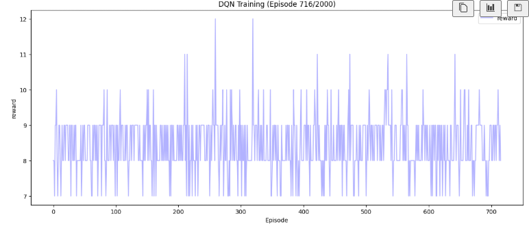
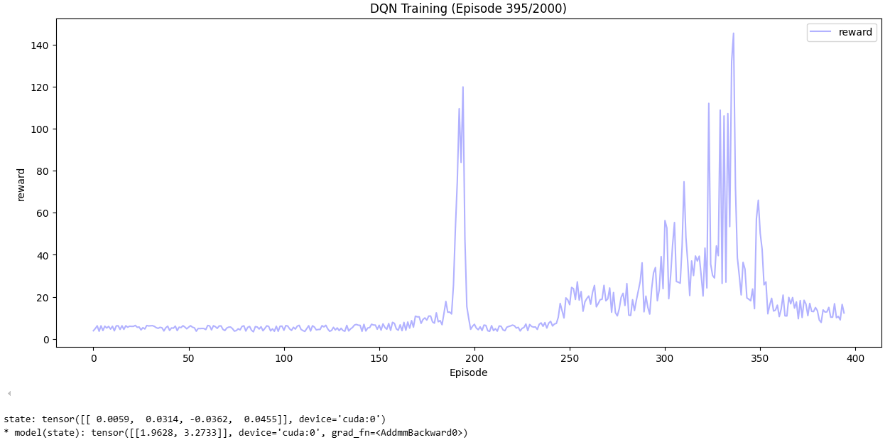
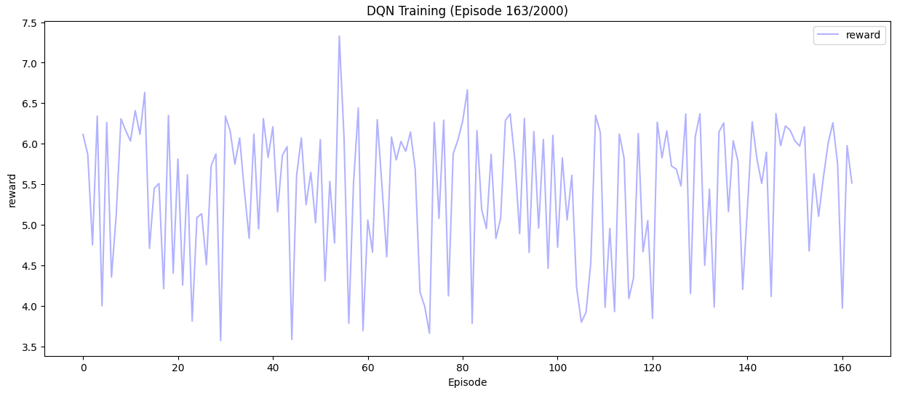
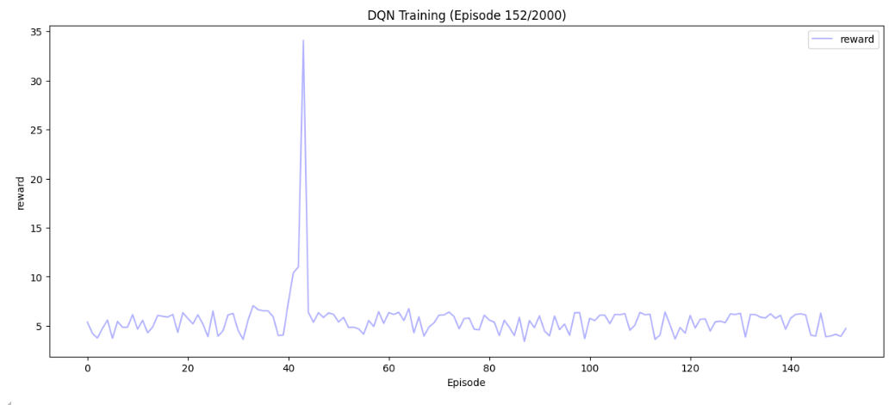

## 问题1：

- 一开始啥也训练不了，尝试找问题：

  

  - 发现输出的Q似乎一直都是0，很奇怪。
- 来自qwen coder，太牛了：

  - 问题：对于 Q-value 网络，输出层通常不使用激活函数，或者使用线性激活（即无激活）。Q 值理论上可以是任意实数（正或负），而 **ReLU 会将所有负值强制为 0**，这极大地限制了网络表达任意 Q 值的能力，可能导致学习效果差或完全无法学习。
  - 直接使用 target_q = reward + self.gamma * q_t_1 然后 target_q.detach() 在逻辑上是可行的（因为 detach() 确实切断了梯度），但它不是最清晰或最标准的写法。它给人一种“先做了不该做的事，再弥补”的感觉。

    - 建议修改：使用 torch.no_grad()，管理上下文，直接不构建计算图
  - 建议修改：使用 torch.no_grad()，管理上下文，直接不构建计算图
  - draw函数资源管理的问题，显示调用plt.close。

## 问题2

- 仍然无效唉。
  - 发现是在指数级增长的啊：
  - model(state): tensor([[  790511.6875, 27387392.0000]], device='cuda:0',
    grad_fn=`<AddmmBackward0>`)

- 修改方案：来自2507的qwen3：

  - 问题可能在于：
    - `target_q = reward + self.gamma * q_t_1`，如果 `q_t_1`很大，而 `gamma`接近1，那么 `target_q`会比当前的 `q`大，导致网络不断增大Q值以接近目标。没有使用目标网络，导致目标值随着网络更新而不断变化，形成了正反馈循环。
    - 对于终止状态，理论上应该有：Q(s,a) ← Q(s,a) + α[r - Q(s,a)]
- 修改尝试：

  - reward的norm操作+降低学习率（尤其是降低学习率啊，这里）：
    - 
    - 归因：
      1. 不用norm，仍然在缓慢增大：
         * 
      2. 不用降低学习率，某个值增长过快导致爆炸：
         * 
  - 尝试添加epsilon衰减，尝试修改gamma的折扣因子。
    - 效果不好。
