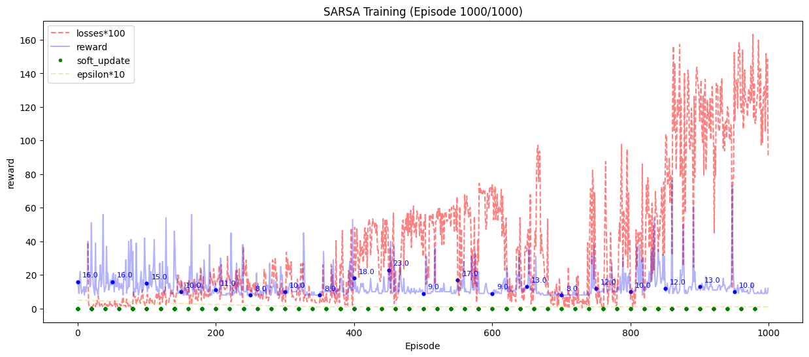

## 总结

1. **一句话：训练效果不佳，收敛但是均值太低基本等于没有训练。**
2. 修复了前面没有注意到的关于neutral network的输出不需要进行relu的问题
3. 学习了参考代码，发现确实收敛不了，那我也就没有必要在做收敛性的分析了
4. 但是实际上我们的代码的效果是收敛的了但是低估了实际上的结果。我决定使用蒙特卡洛的方式训练一下看看效果如何。
5. 最后发现了教材上的一句话，也就是说，可能使用自举的方法本来就偏差很大（方差很小）
   1. 
   2. 决定学完第六章之后再修改这里。

## 问题1：

- 一开始啥也训练不了，尝试找问题：

  

  - 发现输出的Q似乎一直都是0，很奇怪。
- 来自qwen coder，太牛了：

  - 问题：对于 Q-value 网络，输出层通常不使用激活函数，或者使用线性激活（即无激活）。Q 值理论上可以是任意实数（正或负），而 **ReLU 会将所有负值强制为 0**，这极大地限制了网络表达任意 Q 值的能力，可能导致学习效果差或完全无法学习。
  - 直接使用 target_q = reward + self.gamma * q_t_1 然后 target_q.detach() 在逻辑上是可行的（因为 detach() 确实切断了梯度），但它不是最清晰或最标准的写法。它给人一种“先做了不该做的事，再弥补”的感觉。

    - 建议修改：使用 torch.no_grad()，管理上下文，直接不构建计算图
  - 建议修改：使用 torch.no_grad()，管理上下文，直接不构建计算图
  - draw函数资源管理的问题，显示调用plt.close。

## 问题2

- 仍然无效唉。
  - 发现是在指数级增长的啊：
  - model(state): tensor([[  790511.6875, 27387392.0000]], device='cuda:0',
    grad_fn=`<AddmmBackward0>`)

- 修改方案：来自2507的qwen3：

  - 问题可能在于：
    - `target_q = reward + self.gamma * q_t_1`，如果 `q_t_1`很大，而 `gamma`接近1，那么 `target_q`会比当前的 `q`大，导致网络不断增大Q值以接近目标。没有使用目标网络，导致目标值随着网络更新而不断变化，形成了正反馈循环。
    - 对于终止状态，理论上应该有：Q(s,a) ← Q(s,a) + α[r - Q(s,a)]
- 修改尝试：

  - reward的norm操作+降低学习率（尤其是降低学习率啊，这里）：
    - 
    - 归因：
      1. 不用norm，仍然在缓慢增大：
         * 
      2. 不用降低学习率，某个值增长过快导致爆炸：
         * 
  - 尝试添加epsilon衰减，尝试修改gamma的折扣因子。
    - 效果不好。

# 查看示例代码的效果：

发现这个算法似乎确实收敛不了，可能就是这样的。

| 实验结果1（reward）                                                                                                                         | 实验结果2（loss）                                      |
| ------------------------------------------------------------------------------------------------------------------------------------------- | ------------------------------------------------------ |
|  |  |
| 横坐标是step，纵坐标是reward。                                                                                                              | 横坐标是episode_num，纵坐标是loss，也就是(y-q)**2      |

## 学习心得：

1. seed设置 √
2. target网络设置，以及soft update设置（tau=0.01) √
3. 使用原始的reward，尝试看看效果啊。√
4. loss显示 √

   1. 没有加epsilon-decay，导致这里的情况有点奇怪唉：

   * 非常稳健（也许是使用的Q-target的更新速度特别慢吧）
   * 而且没有出现losses过大的情况（也就是没有出现过拟合的问题，应该也是因为前面的原因）
   * 
   * 唯一的问题反而是太过于稳健以至于没有实现比较好的探索。
   * md写错了：
   * 
   * 新的问题是
     1. 探索不足
     2. 更新太快导致没有达到比较好的结果就更新导致目标变化，于是就落下来了。（使用500step）
     3. loss显示不清晰。
     4. epsilon-decay：
        * 修改为使用线性的epsilon-decay，前面使用0.01的时候是比较稳健的，所以说前面使用比较大的epsilon可以实现更大范围的探索唉。
   * 
     * 感觉效果还可以，稳定多了，但是探索性不够，直接就收敛到比较差的情况了。
5. defaultdict(list)：√

## 修改

1. 增大tau为0.1：

   1. 
   2. 只会不稳定，仍然比较差。
   3. 改回0.01
2. 修改更新的时机，使用episode作为更新的时机

   1. 
   2. 效果不好，但是感觉还算合适，可能吧。之前俺选择的是使用500个step进行更新的。
   3. 保留更改。
3. epsilon = Epsilon(original_val=0.5, min_val=0.1, liner_decay=1/5000)

   1. 
   2. mie效果
   3. epsilon = Epsilon(original_val=1, min_val=0.1, liner_decay=1/2000) 采用示例文件中的参数啊。
4. 尝试增大lr，让系统的更新快一些。

   1. 
   2. 尝试在上面的基础上修改一下更新targetq的策略。
      1. 相当稳定：`if total_steps%500 == 0:`
      2. 
      3. (这个是100个step进行一次更新啊)
   3. 修改为一个episode更新一次：
      1. 直接炸了
      2. 
   4. 教材上说，这里的自举实际上是会造成误差的。所以说也许可以暂时不管这里的问题了。
