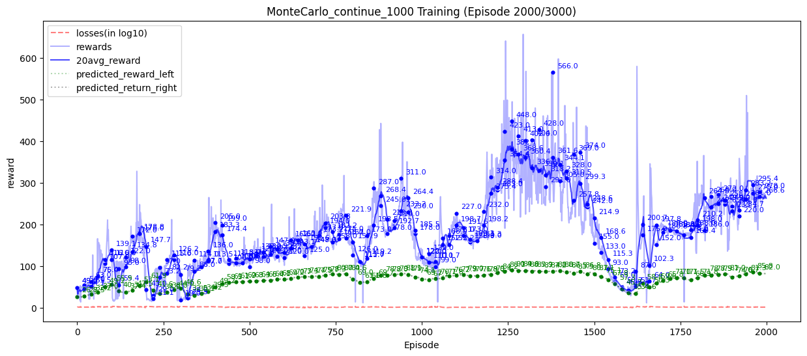
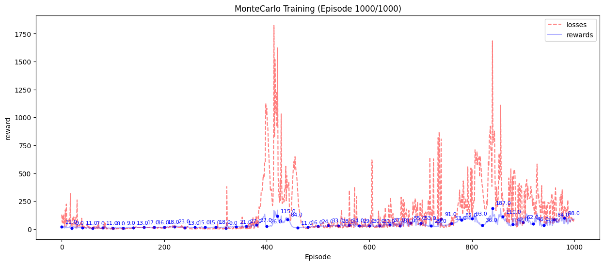
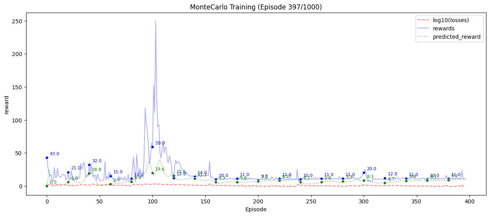
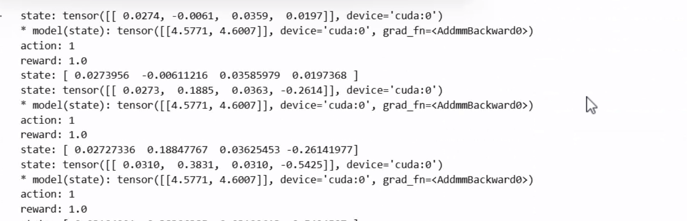
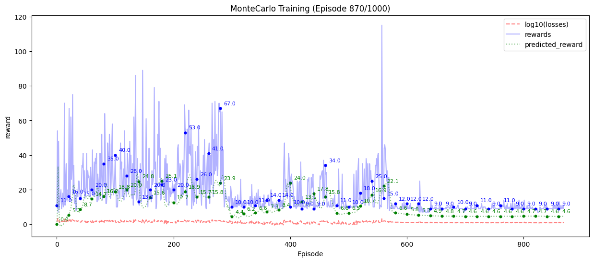
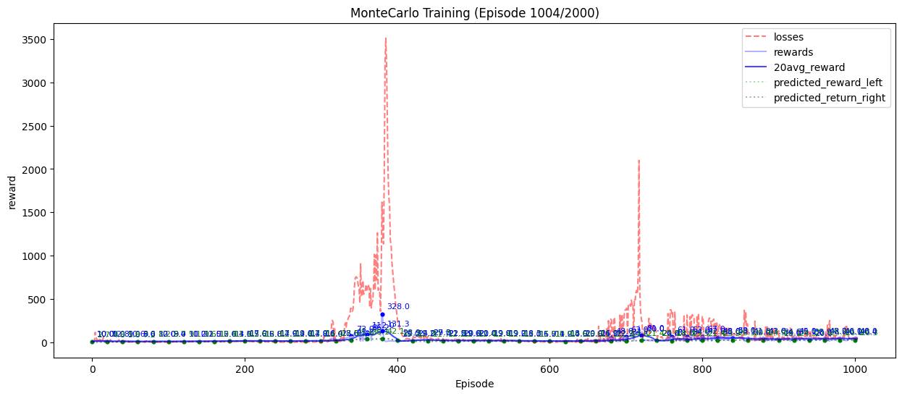
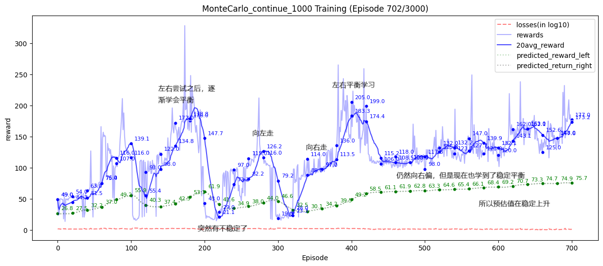
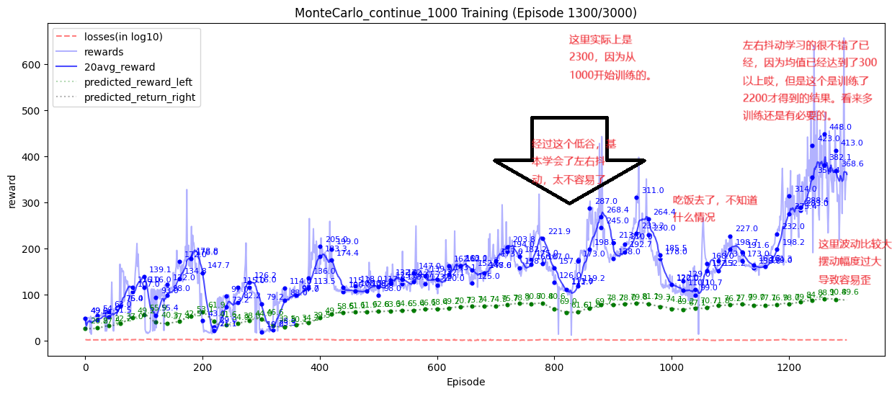
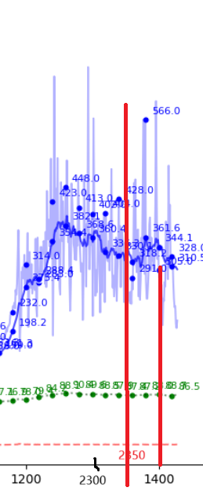
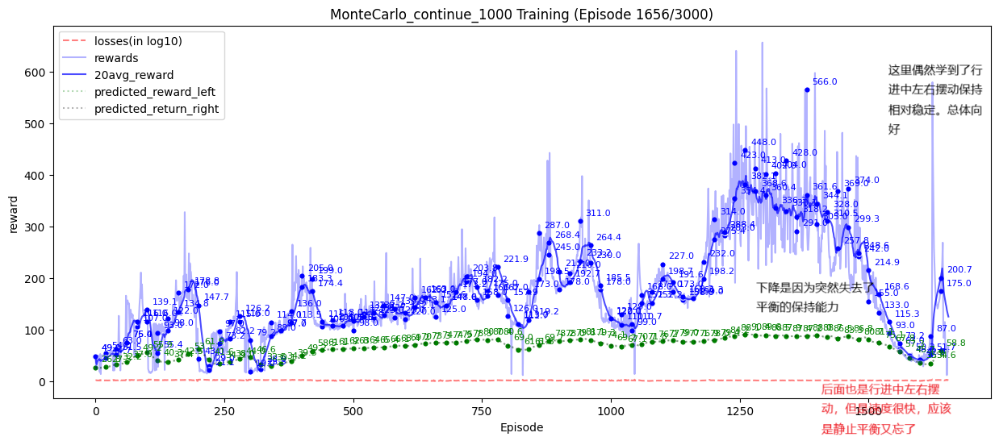

## 总结

- 训练比较稳定，比较快的找到了训练的方向
- 
- 收获：
  - 强化学习需要长时间的学习，3000轮次的学习，比较好的收敛到了149左右，虽然不高（而且是从260左右掉下来的），但是学习到了滑动中左右摆动这样的动态平衡（虽然速度比较快，导致后面的均值不如前面的均值）
  - 学习率选择1e-3是比较好的方案，可以实现学习，其他学习率都太高了，不稳定，而且会过拟合
  - epsilon的选择的话，稳定状态选择0.1作为epsilon保证了稳定探索
  - 继续训练很重要注意保存模型；初始状态的混乱比较严重（1000轮次左右，所以说可能至少要训练到3000轮），可能选择一个基底（也就是pretrained 参数）是比较好的主意
  - 选择一次进行1000轮次的训练还是不错的，也就是说每次都是续训练1000次，而不是直接训练若干千次
- 问题
  - 训练似乎还是不足，需要继续训练。

## 感觉

1. 训练的非常慢
   * 
   * 上图：使用了1e-3的参数训练了1000个轮次，最后估计的return只达到了30-40的样子。
2. 尝试修改lr=0.1或者是0.02之类的
   1. 
   2. 尝试了一下使用lr=0.1，似乎还行？因为学习率比较高，所以跟随比较快，显示出的问题是低估了我们的Q值（也就是return）
3. 尝试修改epsilon的更新方式，使用从1到500episode的线性衰减，而不是使用step作为更新的时机
   * 
   * 发现后期出现了严重的过拟合，需要解决这个问题。
   * 
   * 可以看到后面部分没有一点的生机，可能是由于lr太大了导致的过拟合严重（因为前面的只是训练慢不是不进行训练）
4. 新任务：
   1. 重新测试lr = 0.001下的运行过程
   2. 保存模型文件
   3. 训练2000次首先，看看效果
   4. 添加average的结果，方便查看趋势（注意使用不是特别深的颜色）
5. 发现的主要问题是：
   1. MonteCarlo 实现强化学习：如果偏向于某个方向，就会一直选择这个方向，导致另一个方向得不到更新，于是过拟合越来越严重了
   2. 对比DQN：会有各种的数据可使用，会均匀的实现更馨。
   3. 
      1. 这里发现确实在慢慢变好，也就是说，如果存在一个关键的noise导致在原来的基础上进行了更馨，于是就会对这个动作产生偏离。
      2. 例如一直向右，如果突然向左，使得reward减小，那么对应的Q值就会减小，使得不太会选择向左。
      3. 
      4. 

         1. 突然发现这里如果不做truncated的时候的退出的话，是可以继续训练的。也即：
      5. 有点奇怪，但是2350或者2400感觉还不错哎。
      6. 

         1. **最大长度还是不要超过1000**不然就很密集看不清哎。
         2. 如果可以再学习到对静止平衡的掌控能力应该就可以直接解决了。
         3. 总共训练了180min应该是。也就是3h左右，实现了1000-3000的训练。
      7. 最后：


## 测试结果

```plaintext
Episode 0, Total Reward: [9.0, 9.0, 10.0, 9.0, 10.0, 9.0, 12.0, 8.0, 9.0, 10.0], Average Reward: 9.5
Episode 50, Total Reward: [14.0, 11.0, 10.0, 11.0, 8.0, 10.0, 11.0, 12.0, 12.0, 15.0], Average Reward: 11.4
Episode 100, Total Reward: [14.0, 15.0, 11.0, 10.0, 12.0, 13.0, 10.0, 13.0, 14.0, 12.0], Average Reward: 12.4
Episode 150, Total Reward: [20.0, 14.0, 22.0, 16.0, 20.0, 21.0, 17.0, 13.0, 22.0, 19.0], Average Reward: 18.4
Episode 200, Total Reward: [19.0, 17.0, 19.0, 22.0, 23.0, 23.0, 22.0, 19.0, 20.0, 15.0], Average Reward: 19.9
Episode 250, Total Reward: [21.0, 19.0, 29.0, 20.0, 47.0, 26.0, 30.0, 13.0, 22.0, 15.0], Average Reward: 24.2
Episode 300, Total Reward: [17.0, 18.0, 15.0, 54.0, 13.0, 43.0, 46.0, 43.0, 19.0, 21.0], Average Reward: 28.9
Episode 350, Total Reward: [122.0, 128.0, 116.0, 121.0, 119.0, 113.0, 108.0, 132.0, 125.0, 125.0], Average Reward: 120.9
Episode 400, Total Reward: [13.0, 15.0, 14.0, 17.0, 10.0, 11.0, 16.0, 13.0, 12.0, 14.0], Average Reward: 13.5
Episode 450, Total Reward: [15.0, 18.0, 18.0, 19.0, 14.0, 17.0, 19.0, 15.0, 19.0, 23.0], Average Reward: 17.7
Episode 500, Total Reward: [15.0, 17.0, 15.0, 15.0, 13.0, 13.0, 18.0, 15.0, 15.0, 16.0], Average Reward: 15.2
Episode 550, Total Reward: [14.0, 21.0, 11.0, 15.0, 16.0, 15.0, 13.0, 20.0, 21.0, 18.0], Average Reward: 16.4
Episode 600, Total Reward: [10.0, 16.0, 11.0, 9.0, 14.0, 9.0, 11.0, 10.0, 20.0, 11.0], Average Reward: 12.1
Episode 650, Total Reward: [19.0, 14.0, 13.0, 9.0, 9.0, 11.0, 16.0, 12.0, 10.0, 15.0], Average Reward: 12.8
Episode 700, Total Reward: [12.0, 18.0, 16.0, 11.0, 10.0, 13.0, 16.0, 10.0, 11.0, 10.0], Average Reward: 12.7
Episode 750, Total Reward: [33.0, 66.0, 40.0, 76.0, 83.0, 50.0, 21.0, 77.0, 33.0, 32.0], Average Reward: 51.1
Episode 800, Total Reward: [68.0, 47.0, 81.0, 43.0, 76.0, 23.0, 43.0, 78.0, 72.0, 41.0], Average Reward: 57.2
Episode 850, Total Reward: [55.0, 66.0, 28.0, 21.0, 54.0, 54.0, 28.0, 51.0, 66.0, 61.0], Average Reward: 48.4
Episode 900, Total Reward: [50.0, 46.0, 57.0, 48.0, 50.0, 54.0, 59.0, 54.0, 30.0, 46.0], Average Reward: 49.4
Episode 950, Total Reward: [52.0, 54.0, 30.0, 64.0, 58.0, 62.0, 45.0, 53.0, 56.0, 53.0], Average Reward: 52.7
Episode 1000, Total Reward: [28.0, 59.0, 63.0, 59.0, 57.0, 25.0, 63.0, 53.0, 57.0, 54.0], Average Reward: 51.8
Episode 1050, Total Reward: [84.0, 141.0, 185.0, 73.0, 140.0, 79.0, 90.0, 72.0, 75.0, 83.0], Average Reward: 102.2
Episode 1100, Total Reward: [29.0, 105.0, 27.0, 21.0, 20.0, 110.0, 18.0, 118.0, 20.0, 24.0], Average Reward: 49.2
Episode 1150, Total Reward: [131.0, 104.0, 119.0, 116.0, 113.0, 144.0, 123.0, 103.0, 110.0, 93.0], Average Reward: 115.6
Episode 1200, Total Reward: [36.0, 35.0, 44.0, 67.0, 50.0, 101.0, 37.0, 47.0, 39.0, 46.0], Average Reward: 50.2
Episode 1250, Total Reward: [102.0, 56.0, 87.0, 72.0, 104.0, 50.0, 59.0, 126.0, 97.0, 117.0], Average Reward: 87.0
Episode 1300, Total Reward: [17.0, 16.0, 21.0, 22.0, 16.0, 24.0, 15.0, 16.0, 17.0, 21.0], Average Reward: 18.5
Episode 1350, Total Reward: [89.0, 93.0, 99.0, 90.0, 82.0, 72.0, 79.0, 96.0, 92.0, 81.0], Average Reward: 87.3
Episode 1400, Total Reward: [139.0, 116.0, 116.0, 110.0, 154.0, 106.0, 104.0, 105.0, 116.0, 115.0], Average Reward: 118.1
Episode 1450, Total Reward: [121.0, 179.0, 111.0, 226.0, 122.0, 131.0, 111.0, 107.0, 108.0, 124.0], Average Reward: 134.0
Episode 1500, Total Reward: [144.0, 123.0, 184.0, 107.0, 113.0, 203.0, 131.0, 104.0, 148.0, 113.0], Average Reward: 137.0
Episode 1550, Total Reward: [151.0, 143.0, 161.0, 146.0, 129.0, 213.0, 151.0, 138.0, 128.0, 131.0], Average Reward: 149.1
Episode 1600, Total Reward: [114.0, 159.0, 176.0, 220.0, 145.0, 183.0, 122.0, 170.0, 130.0, 150.0], Average Reward: 156.9
Episode 1650, Total Reward: [187.0, 161.0, 226.0, 199.0, 143.0, 148.0, 165.0, 169.0, 98.0, 165.0], Average Reward: 166.1
Episode 1700, Total Reward: [227.0, 177.0, 217.0, 119.0, 187.0, 148.0, 162.0, 147.0, 133.0, 189.0], Average Reward: 170.6
Episode 1750, Total Reward: [164.0, 192.0, 207.0, 290.0, 163.0, 192.0, 290.0, 154.0, 168.0, 156.0], Average Reward: 197.6
Episode 1800, Total Reward: [115.0, 108.0, 109.0, 141.0, 97.0, 102.0, 141.0, 94.0, 96.0, 104.0], Average Reward: 110.7
Episode 1850, Total Reward: [102.0, 171.0, 171.0, 122.0, 151.0, 136.0, 154.0, 100.0, 132.0, 193.0], Average Reward: 143.2
Episode 1900, Total Reward: [212.0, 193.0, 247.0, 254.0, 212.0, 187.0, 219.0, 198.0, 196.0, 259.0], Average Reward: 217.7
Episode 1950, Total Reward: [151.0, 124.0, 144.0, 109.0, 141.0, 172.0, 123.0, 152.0, 176.0, 143.0], Average Reward: 143.5
Episode 2000, Total Reward: [106.0, 113.0, 109.0, 115.0, 110.0, 122.0, 104.0, 106.0, 86.0, 127.0], Average Reward: 109.8
Episode 2050, Total Reward: [159.0, 131.0, 162.0, 159.0, 165.0, 171.0, 149.0, 168.0, 161.0, 176.0], Average Reward: 160.1
Episode 2100, Total Reward: [105.0, 222.0, 127.0, 142.0, 184.0, 149.0, 187.0, 114.0, 284.0, 223.0], Average Reward: 173.7
Episode 2150, Total Reward: [192.0, 237.0, 153.0, 183.0, 169.0, 192.0, 178.0, 246.0, 200.0, 185.0], Average Reward: 193.5
Episode 2200, Total Reward: [103.0, 154.0, 242.0, 146.0, 168.0, 123.0, 146.0, 158.0, 239.0, 155.0], Average Reward: 163.4
Episode 2250, Total Reward: [262.0, 144.0, 284.0, 225.0, 174.0, 180.0, 156.0, 157.0, 143.0, 171.0], Average Reward: 189.6
Episode 2300*, Total Reward: [192.0, 205.0, 341.0, 307.0, 198.0, 222.0, 273.0, 177.0, 338.0, 397.0], Average Reward: 265.0
Episode 2350, Total Reward: [241.0, 266.0, 230.0, 194.0, 278.0, 303.0, 294.0, 192.0, 183.0, 205.0], Average Reward: 238.6
Episode 2400, Total Reward: [206.0, 206.0, 288.0, 195.0, 201.0, 209.0, 187.0, 183.0, 219.0, 196.0], Average Reward: 209.0
Episode 2450, Total Reward: [156.0, 202.0, 369.0, 211.0, 229.0, 229.0, 221.0, 233.0, 196.0, 260.0], Average Reward: 230.6
Episode 2500, Total Reward: [242.0, 240.0, 210.0, 215.0, 192.0, 296.0, 212.0, 343.0, 217.0, 191.0], Average Reward: 235.8
Episode 2550, Total Reward: [341.0, 110.0, 86.0, 79.0, 109.0, 86.0, 163.0, 80.0, 84.0, 104.0], Average Reward: 124.2
Episode 2600*, Total Reward: [29.0, 1804.0, 50.0, 39.0, 30.0, 36.0, 82.0, 42.0, 66.0, 63.0], Average Reward: 224.1
Episode 2650, Total Reward: [269.0, 224.0, 231.0, 62.0, 186.0, 219.0, 105.0, 426.0, 76.0, 258.0], Average Reward: 205.6
Episode 2700, Total Reward: [182.0, 164.0, 218.0, 164.0, 163.0, 174.0, 195.0, 169.0, 183.0, 179.0], Average Reward: 179.1
Episode 2750, Total Reward: [159.0, 152.0, 168.0, 160.0, 177.0, 150.0, 153.0, 169.0, 151.0, 161.0], Average Reward: 160.0
Episode 2800, Total Reward: [188.0, 184.0, 190.0, 187.0, 175.0, 234.0, 193.0, 179.0, 184.0, 204.0], Average Reward: 191.8
Episode 2850, Total Reward: [202.0, 194.0, 222.0, 202.0, 219.0, 191.0, 187.0, 186.0, 200.0, 233.0], Average Reward: 203.6
Episode 2900, Total Reward: [183.0, 216.0, 203.0, 189.0, 213.0, 196.0, 190.0, 219.0, 193.0, 218.0], Average Reward: 202.0
Episode 2950, Total Reward: [206.0, 226.0, 220.0, 199.0, 216.0, 212.0, 234.0, 222.0, 225.0, 212.0], Average Reward: 217.2
```

反正总体来看，是由效果的，可能需要继续训练一段时间。最后也没有寻找到最优的方案，说明蒙特卡洛的方案差于DQN的方案，但是更加稳定。
